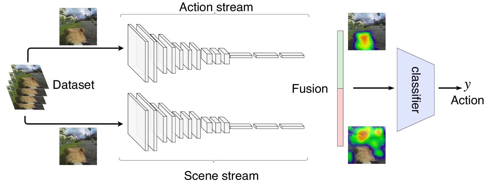

# Using Scene Context to Improve Action Recognition

Recently action recognition has been used for a variety of applications such as surveillance, smart homes, and in-home elder monitoring. 
Such applications usually focus on recognizing human actions without taking into account the different scenarios where the action occurs. 
In this paper, we propose a two-stream architecture that considers not only the movements to identify the action, but also the context scene where the action is performed. 
Experiments show that the scene context may improve the recognition of certain actions. 
Our proposed architecture is tested against baselines and the standard two-stream network.

